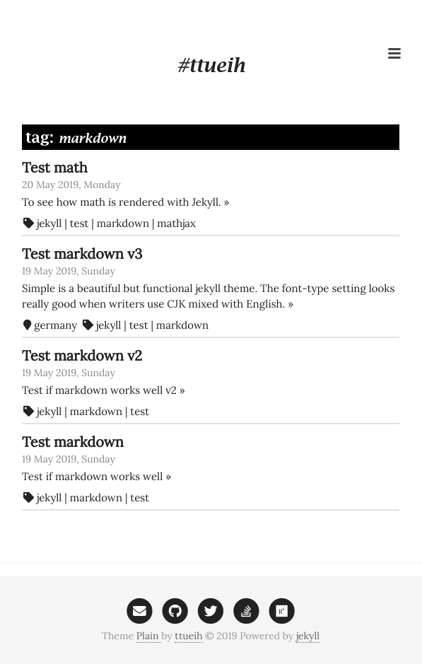
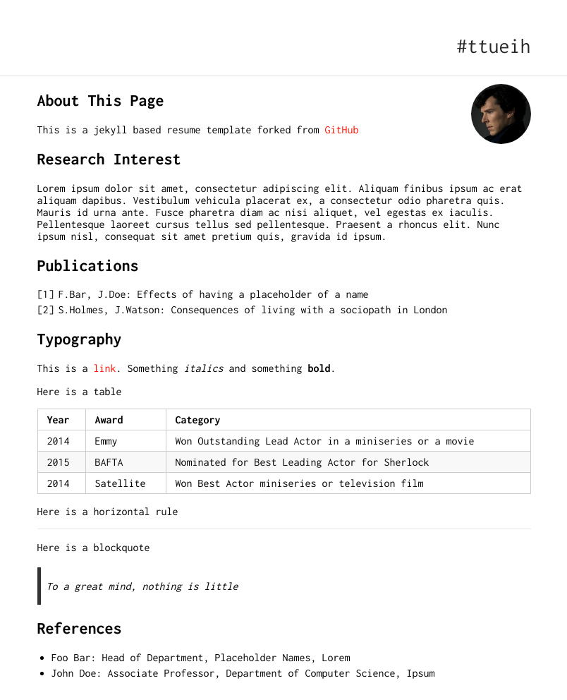
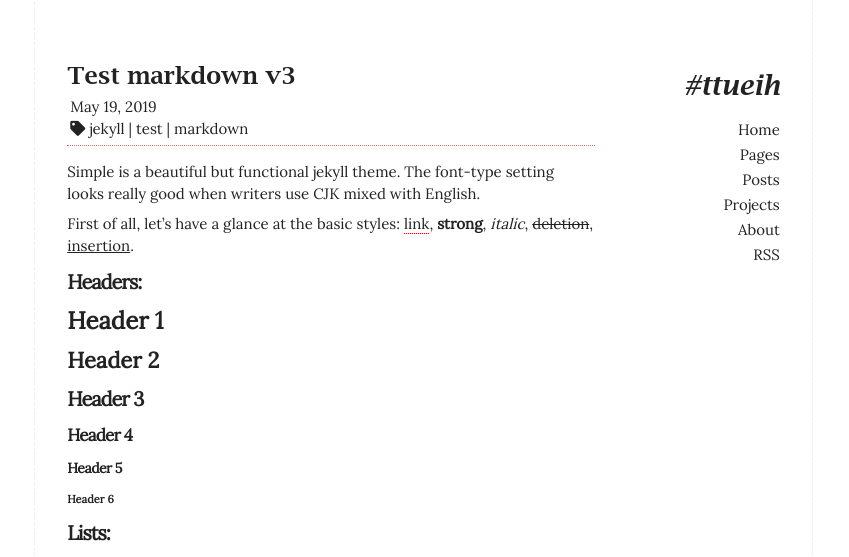

# jekyll-plain

Another simple, two-column template for Jekyll.
The theme is built on [jekyll-simple](https://github.com/wild-flame/jekyll-simple).

## Screenshots




## Installation
### Running and testing locally
Simply fork the repository and install dependencies.

```
git clone https://github.com/ttueih/jekyll-plain.git
cd jekyll-plain/
bundle install
```

Start local server and access the website at `https://127.0.0.1:4000/`
```
./run_local.sh
```
### Essential configuration
#### Navigation
Navigation panel was shown to the right of the website and its content can be configured by modifying `_data/nav.yml` file and the variable `navigations` in `_config.yml`.

New navigation item can be defined in `_data/nav.yml` with as similar structure as this
```
home:
  text: "Home"
  link: "/"
pages:
  text: "Pages"
  link: "/pages"
...
```
and then we can enable and order them with `navigations` variable in `_config.yml`:
```
navigations: [home,pages,posts,projects,about ,feed]
```

#### Tagging
We have tagging implemented as a Yekyll collection. All possible tags are located in the folder `_tags`. 
Checking the folder, we see 6 available tags:  `jekyll, markdown, mathjax, project, spacemacs, test`.

```
_tags/
├── jekyll.md
├── markdown.md
├── mathjax.md
├── project.md
├── spacemacs.md
└── test.md
```
When a new tag is needed for example a tag name `code`, simply create a new file `code.md` in `_tags` folder with the following content.
```
---
name: code
---

```

#### Collections
The way Jekyll handle a post is quite inconvenient to me. Normally, we need to create a file with name format like `YYYY-MM-DD-Whatever-name.md` in `_posts` folder.
Based on the given date as prefix of the filename, Jekyll will create a permanent link for it (put to `_sites/year/month/date` folder). 
I find it more convenient to define date in the preamble of each post which allows me to modify it without messing aroud with permanent links.

In this template, two other collections (`pages` and `projects`) are introduce along with the default `posts` collection. All markdown files which are put in `_pages` or `_projects` will be generated in `pages` or `projects` collection respectively.
For each posts in these new collections, we need to specify a `date` variable in the preamble.
It allows Jekyll to order all the posts correctly.

An example of preamble :
```
---
layout: post
title: <Post title>
tags: [jekyll, markdown, test]
date: 2019-05-19 8:06:26 +0100
description: This description will be shown in summary page. 
---
```

For creating a new collection, you should refer to the following checklist:
 + Add collection info to `collections` variable  in `_config.yml`
 + Set default layout for post in this collection by edit the variable `defaults` in `_config.yml`
 + Create a folder with the same name as the collection to host all new posts.
 + Make this collection accessable in your website:
   + Create file `<collecton_name>.html` in project root folder with the following content and make sure that you change all `<collection_name>` to your *collection name*.
   ```
    ---
    layout: default
    title: <collection_name>
    ---
    <div class="home">
      <div class="post-list">
        <h1 class="post-list-title"> Articles </h1>

        
        
      </div>
    </div>

   ```
   + Add an item to `_data/nav.yml`
   ``` 
   <collection_name>:
     text: "New Collection"
     link: "/<collection_name>"

   ```
   + Add the item to `navigations` variable in `_config.yml`
#### Font Family
There are severl font family options defined in `_config.yml`, simply uncomment them to try out.
```
font-family: ['Lora', serif]
# font-family: ["Inconsolata", monospace]
# font-family: ['Source Sans Pro', sans-serif]
# font-family: ['Source Code Pro', monospace]
# font-family: ["Lucida Sans Typewriter", "Lucida Console", monaco, "Bitstream Vera Sans Mono", monospace]
# font-family: ["Courier New", Courier, "Lucida Sans Typewriter", "Lucida Typewriter", monospace]
```

#### Number of posts for index page
The number of posts which are listed in the index page can be controlled by the variable `max-home-items` in `_config.yml`.


## Credits

This Jekyll template is built based on the layout work of [David Lin](https://github.com/wild-flame/jekyll-simple)
and the CV page is cloned from the work of [Ankit Sultana](https://ankitsultana.com/researcher/).
